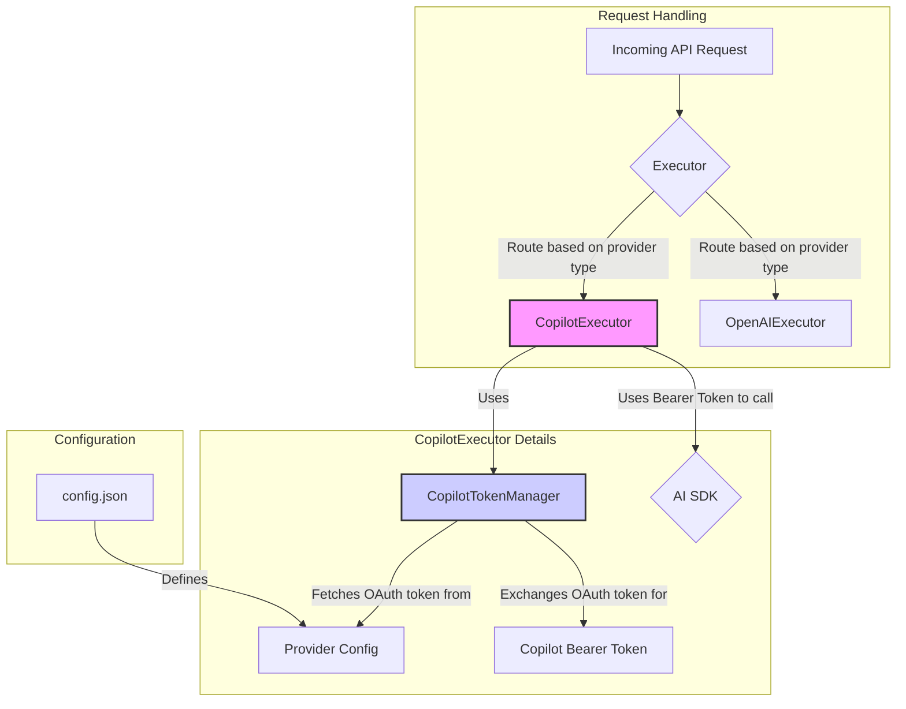

# Integrating GitHub Copilot as a New Executor

This document outlines the plan to integrate GitHub Copilot as a new executor within the existing application framework. The goal is to support Copilot's unique authentication mechanism while adhering to the established architectural patterns.

## Architecture

The proposed architecture introduces a `CopilotExecutor` and a `CopilotTokenManager` to handle the specific needs of the Copilot API.

## Implementation Plan

The implementation will be carried out in three phases:

### Phase 1: Create `CopilotTokenManager`
A new class, `CopilotTokenManager`, will be created to manage the authentication lifecycle.
- **Responsibilities**:
    - Fetching and caching the short-lived bearer token from the Copilot API.
    - Using a long-lived GitHub OAuth token provided via configuration.
    - Handling token expiration and renewal.
- **Location**: `src/components/CopilotTokenManager.ts`

### Phase 2: Implement `CopilotExecutor`
A new executor class, `CopilotExecutor`, will be created to handle proxying requests.
- **Responsibilities**:
    - Extend `BaseExecutor`.
    - Use `CopilotTokenManager` to get a valid bearer token.
    - Construct and send requests to the Copilot API using the AI SDK.
- **Location**: `src/components/executors/CopilotExecutor.ts`

### Phase 3: Configuration and Registration
The final phase involves integrating the new components into the application.
- **Tasks**:
    - Update `src/schemas/provider.schema.ts` to include `'copilot'` as a provider type and define its configuration.
    - Register the `CopilotExecutor` in `src/components/Executor.ts`.
    - Update `src/components/executors/index.ts` to export the new executor.

## Task List

- [ ] Create `copilot.md` with the plan.
- [ ] Create `src/components/CopilotTokenManager.ts`.
- [ ] Create `src/components/executors/CopilotExecutor.ts`.
- [ ] Update `src/schemas/provider.schema.ts`.
- [ ] Update `src/components/executors/index.ts`.
- [ ] Update `src/components/Executor.ts`.

## Future Enhancements
- **Device Code Flow**: The initial implementation will rely on a pre-configured GitHub OAuth token. A future enhancement will be to implement the full OAuth Device Code Flow, allowing users to authenticate interactively. This would involve creating a new endpoint and UI to guide the user through the login process, as seen in the `copilot-proxy` submodule.